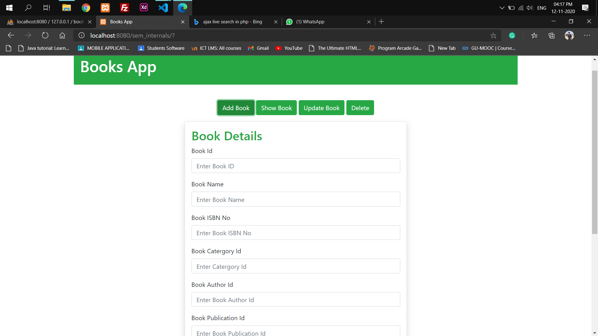
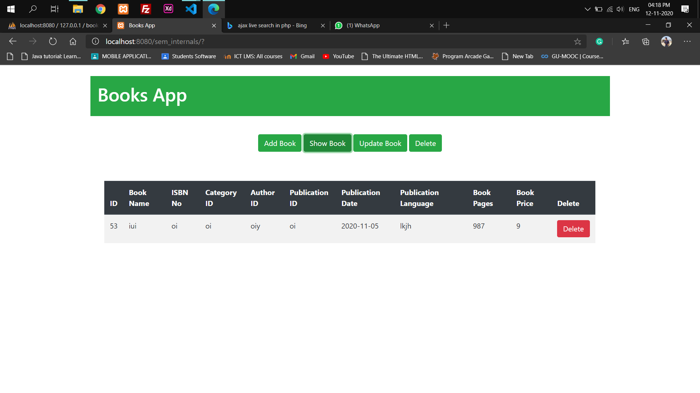
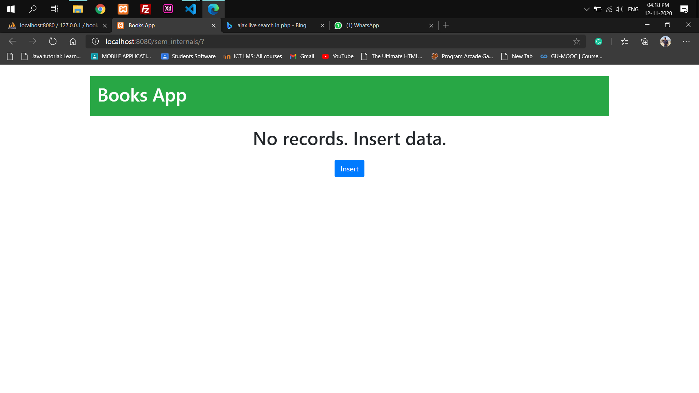

# Books App 1.0 v
Books App is a simple small application to manage the books in a store. 
## Features
- Small simple web app 
- Light weight
- Modern UI
- Easy to use

## Dependencies
- Web Server (Xampp / Wampp)
- php 5 or higher
- MySQL or phpMyAdmin

## Languages
- Hmtl 5
- CSS
- JQuery
- Ajax
- Php
- MySQL

## Enviorment Setup
1) Clone the repo in htdocs or www folder 
```sh
git clone https://github.com/meezan-mallick/books_app
```
2) Turn on the web server (Apache and phpmyadmin)
3) Setup database credentials in database.php file
  >> import the database script file "books_app.sql" and run <br>
  >> open the database.php file and edit accordingly
  ```php
  define(DB_NAME,"<database_name>")
  ```
4) open the browser and run the app

## Screen Shots




### [Meezan Mallick](https://github.com/meezan-mallick)
